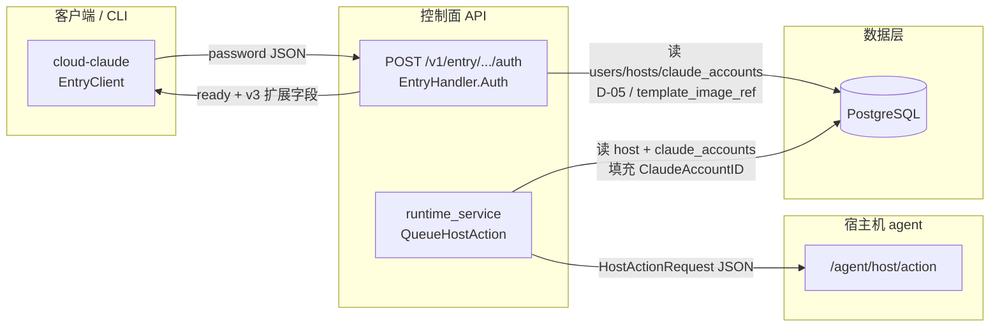

# Phase 30: 控制面数据模型 + Entry API 扩展 - Research

**Researched:** 2026-04-18  
**Domain:** Go 控制面 HTTP（Entry）、PostgreSQL 迁移、JSON 契约向后兼容、`HostActionRequest` 与 cloud-claude 客户端  
**Confidence:** HIGH（仓库与 CONTEXT 已对齐；`ClaudeAccountID` enqueue 默认策略已收敛，见下文 **Open Questions** 修订稿）

## Summary

本阶段在**不交付任何面向用户的 REQ-F\*** 前提下，补齐 v3 握手所需的数据面与 JSON 契约：`claude_accounts.persistent_volume_name` 可空列、`HostActionRequest` 增加 `ClaudeAccountID`、`POST /v1/entry/{shortId}/auth` 在 `status=ready` 时追加 `image_version` / `supports_mutagen` / `supports_mergerfs` / `claude_account_id`（均为 `omitempty`），以及 `internal/cloudclaude.AuthResponse` 的同步扩展与单元测试。

仓库现状：`EntryHandler.Auth` 仅在 `ready` 时返回五元 SSH 字段 [`internal/controlplane/http/entry.go`](internal/controlplane/http/entry.go)；`Repository` 尚无 `claude_accounts` 读路径 [`internal/store/repository/queries.go`](internal/store/repository/queries.go)；`HostActionRequest` 已由 Phase 29 增加 `Volumes`，`runtime_service` 组装的请求仍未填 `Volumes`/`ClaudeAccountID` [`internal/runtime/runtime_service.go`](internal/runtime/runtime_service.go)。迁移最新序号为 `0013`，与 CONTEXT **D-10** 指定的 `0014_claude_account_persistent_volume.sql` 一致 [VERIFIED: `internal/store/migrations/*.sql` 列表]。

**与 Phase 29 文档的一点差异（以 Phase 30 CONTEXT 为准）：** 29-CONTEXT **D-27** 写「Phase 30 从 `image.lock` 读能力字段写入 `AuthResponse`」；**30-CONTEXT D-04～D-07** 已锁定能力字段由控制面根据 `hosts.template_image_ref` 做**纯字符串 tag 解析**与 **`v3.0.0` 字面相等**推导，且不调 registry。**规划与实现必须以 30-CONTEXT 为准** [CITED: `.planning/phases/30-entry-api/30-CONTEXT.md`；对照 `.planning/phases/29-v3-worker/29-CONTEXT.md`]。

**Primary recommendation：** 以 `0014` 迁移 + `ClaudeAccount` 模型扩展为底座；在 `EntryStore` 增加按 **D-05** 规则解析 `claude_account_id` 的查询，并在 `ready` 分支用 `Host.TemplateImageRef` 实现 **D-06/D-07**；契约层补 `HostActionRequest.ClaudeAccountID` 与现有 `worker_volume_test` 同类 JSON 测试；**默认在 Phase 30 于 `runtime_service.QueueHostAction` 组装请求时写入 `ClaudeAccountID`（与 Entry 同源 D-05 查询语义）**，使 host-agent 链路与 Phase 33 前置排障一致，避免「契约已加字段但链路上恒为空」的灰区。

<user_constraints>
## User Constraints（from CONTEXT.md）

以下自 `.planning/phases/30-entry-api/30-CONTEXT.md` **原文分段拷贝**，避免与 planner 摘要产生偏差。

## Implementation Decisions

### Q4 · 持久化 volume 命名（ROADMAP Open question）

- **D-01**：锁定 **单 named volume**：`claude-state-{claude_account_id}`（UUID 无连字符或与 DB 一致，由实现选定但全仓库一致）；Docker label `com.cloud-cli-proxy.account_id={claude_account_id}` 由 Phase 33 在 `volume create` 时写入。本阶段 migration 仅提供列，不强制非空。
- **D-02**：`persistent_volume_name` 列语义：**`NULL` = 尚未由控制面/任务分配名称**；一旦分配则与 D-01 规范一致，便于 Phase 33 `ensureDockerVolume` 幂等查找。禁止用空字符串表示「未分配」，减少三态。

### Q5 · 能力字段暴露面

- **D-03**：采用 ROADMAP 倾向 **(a)**——在现有 **`/v1/entry/{shortId}/auth`** 成功响应体中追加字段；**不**新增 `/capabilities` 或额外 round-trip endpoint。

### Q6 · host-agent 与镜像元数据

- **D-04**：维持 Phase 29 结论——**不**扩展 host-agent 返回 Docker image labels；`image_version` 与 `supports_*` 全部由**控制面**根据 `hosts.template_image_ref`（及可选的受管镜像 tag 约定）推导。

### Entry API 查询与字段推导

- **D-05**：`claude_account_id` 选择规则（同一主机多账号前的确定性）：
  1. `SELECT id FROM claude_accounts WHERE host_id = <当前已解析主机的 UUID> ORDER BY created_at ASC LIMIT 1`；
  2. 若无行，则 `WHERE user_id = <user.id> AND host_id IS NULL ORDER BY created_at ASC LIMIT 1`；
  3. 若仍无，**省略** `claude_account_id` 字段（`omitempty`），`supports_mutagen` / `supports_mergerfs` 仍按 D-06 仅依据镜像推导（可能为 `false`）。
- **D-06**：`image_version` 从 `hosts.template_image_ref` 解析——取最后一个 `:` 后的 tag（若无 `:` 则整串）；仅做字符串规范化（trim），**不**在 Phase 30 调用 Docker registry API。
- **D-07**：`supports_mutagen` 与 `supports_mergerfs`：当解析出的 `image_version` 与受管 v3 基线 tag **`v3.0.0`** 相等（字符串相等）时为 `true`，否则 `false`。后续若有多 tag，由后续 phase 扩展对照表；本阶段保持与 ROADMAP Success Criteria 字面一致。
- **D-08**：`status` 为 `not_ready` 或非 `ready` 的响应体 **不强制**带 v3 扩展字段（可为省略）；`ready` 路径必须带齐 ROADMAP 验收所列字段（在账号存在前提下 `claude_account_id` 非空）。

### HostActionRequest

- **D-09**：新增 `ClaudeAccountID string \`json:"claude_account_id,omitempty"\``（字段名与 JSON 与 ROADMAP 一致）。与 Phase 29 **D-21** 对齐：Phase 29 已交付 `Volumes`，本阶段交付账号 ID 供 Phase 33 组装 volume 与 worker 使用。

### 迁移与兼容

- **D-10**：新 migration 序号为 **`0014_claude_account_persistent_volume.sql`**（当前仓库最新为 `0013`，与 ROADMAP 一致）；在干净库与自 v2.0 升级库上 `up`/`down` 可重复执行（幂等 `IF NOT EXISTS` / 安全 `DROP`）。

### Claude's Discretion

- **D-11**：`EntryStore` 具体方法签名与是否合并查询（单次 JOIN vs 多次查询）由实现者按性能与可测性选择，只要不引入 N+1 明显回退。
- **D-12**：admin / GraphQL 等未在 ROADMAP 本 phase 列出的 surface **不在此 phase 扩展**。

### Folded Todos

（`todo match-phase` 无匹配，本节省略。）

## Deferred Ideas

- **双 volume**（creds/cache 分离）与 **`ccp_` 前缀命名**：已在 Q4 明确推迟；若运维提出再开 phase 或 backlog。
- **独立 `/capabilities` endpoint**：Q5 已关闭；若未来需无凭证探测能力再评估。
- **从 registry / image inspect 读取 labels 推导能力**：Q6 已关闭；与 host-agent 扩展一并留给更远期。

### Reviewed Todos (not folded)

无。

</user_constraints>

> **Planner 注（非 CONTEXT 原文，与 D-10 对齐）：** 仓库内 `internal/store/migrator/migrator.go` 的 `RunMigrations` **仅执行向上迁移**（`*.sql` 排序、`schema_migrations` 去重、无自动 `down` runner）[VERIFIED: `internal/store/migrator/migrator.go`]。故 D-10「干净库与升级库上可重复执行」应落实为：**升级路径**用 `ADD COLUMN IF NOT EXISTS` 等幂等 DDL；**回滚路径**仅在迁移文件内手写 `DROP COLUMN IF EXISTS ...`（或运维删除 `schema_migrations` 对应 filename 后人工执行逆向 SQL）— **勿**假设存在 golang-migrate 式独立 `down` 文件或 CI 自动 down。

<phase_requirements>
## Phase Requirements

| ID / 来源 | 描述 | Research Support |
|-----------|------|------------------|
| ROADMAP Phase 30 Goal | 打开客户端动态能力探测控制面通道 | Entry 响应扩展 + DB 列 + `HostActionRequest` 字段 |
| ROADMAP Success #1 | migration `0014` 干净库与升级库上可重复 / 可回滚执行 | **Up：** `ADD COLUMN IF NOT EXISTS` 等与 `RunMigrations` 兼容的幂等 DDL [VERIFIED: `internal/store/migrator/migrator.go` 仅 forward]；**Down：** 同文件内显式 `DROP COLUMN IF EXISTS`（无自动 down runner） |
| ROADMAP Success #2 | 旧 `AuthResponse` 调新 API 不报错、未知字段忽略 | Go `encoding/json` 默认忽略未知 object 键 [CITED: https://pkg.go.dev/encoding/json] |
| ROADMAP Success #3 | v3 客户端读到示例值（在测试数据满足 D-05 时） | `template_image_ref` 含 `:v3.0.0` + 存在 `claude_accounts` 行 |
| ROADMAP Success #4 | host-agent 解析 `Volumes`（无新 endpoint） | Phase 29 已交付；本阶段补 `ClaudeAccountID` 的 JSON round-trip 测试即可对齐验收表述 |
| REQ-F7-A（主映射 Phase 33） | named volume 命名与 label 约定 | 本 phase 仅 `persistent_volume_name` 列与 Entry/`HostActionRequest` 的 id 通道；**不**执行 `docker volume create` [CITED: `.planning/REQUIREMENTS.md` Traceability 表] |

</phase_requirements>

## Architectural Responsibility Map

| Capability | Primary Tier | Secondary Tier | Rationale |
|------------|-------------|----------------|-----------|
| `persistent_volume_name` DDL 与 ORM 字段 | Database / Storage | API / Backend | 列属于 Postgres；Go struct 在 `repository` |
| `claude_account_id` 解析（D-05） | API / Backend | Database / Storage | 业务规则在控制面；查询落 `repository` |
| `image_version` / `supports_*` 推导（D-06/07） | API / Backend | — | 仅依赖已持久化的 `hosts.template_image_ref`，无 registry 调用 |
| Entry JSON 响应形状 | API / Backend | — | `EntryHandler` 拥有响应序列化 |
| `AuthResponse` 反序列化 | Browser / Client（CLI） | — | `cloud-claude` 作为 HTTP 客户端消费 Entry |
| `HostActionRequest.ClaudeAccountID` | API / Backend（契约 + enqueue） | — | 类型在 `agentapi`；**默认**由 `runtime_service` 在入队时写入（与 Open Questions 修订稿一致） |

## Standard Stack

### Core

| Library | Version | Purpose | Why Standard |
|---------|---------|---------|--------------|
| Go | `go 1.25.7`（`go.mod`）；本机工具链 `go1.26.1` [VERIFIED: `go.mod` + `go version`] | 控制面与 CLI | 项目既定运行时 |
| `encoding/json` | 随 Go 标准库 | Entry 响应与 `AuthResponse` 反序列化 | 官方实现；未知字段默认忽略 [CITED: https://pkg.go.dev/encoding/json] |
| `github.com/jackc/pgx/v5` | v5.7.6 [VERIFIED: `go.mod`] | Postgres 访问 | 与全仓库 `repository` 模式一致 |
| `golang.org/x/crypto` bcrypt | v0.41.0 [VERIFIED: `go.mod`] | Entry 密码校验 | 已在 `entry.go` 使用 |

### Supporting

| Library | Version | Purpose | When to Use |
|---------|---------|---------|-------------|
| `strings` 标准库 | — | 解析 `template_image_ref` 的 tag（`LastIndex` + `TrimSpace`） | 满足 D-06，无需引入 OCI 客户端 |

### Alternatives Considered

| Instead of | Could Use | Tradeoff |
|------------|-----------|----------|
| 从 `image.lock` 推导能力（29-CONTEXT D-27） | 按 30-CONTEXT 用 `hosts.template_image_ref` | 29 文档此处已被 30 锁定决策覆盖；勿混用 |

**Version verification：** `go list -m github.com/jackc/pgx/v5` → `v5.7.6` [VERIFIED: `go.mod`]。

## Architecture Patterns

### System Architecture Diagram



说明：**能力字段**仅经 Entry 响应下发（**D-03/D-04**）；**`ClaudeAccountID`** 默认在控制面 **enqueue** 与 **Entry** 两侧同源规则（D-05）解析，再进入 `HostActionRequest`。**禁止**依赖 host-agent 回传镜像 labels 推导 `image_version` / `supports_*`。

### Recommended Project Structure（本 phase 相关增量）

```
internal/store/migrations/
└── 0014_claude_account_persistent_volume.sql   # ADD COLUMN persistent_volume_name
internal/store/repository/
├── models.go          # ClaudeAccount + PersistentVolumeName 指针字段
└── queries.go         # 按 D-05 查询 claude_account id（新函数）
internal/controlplane/http/
└── entry.go           # EntryStore 接口扩展 + ready 响应键
internal/cloudclaude/
└── entry.go           # AuthResponse 新字段 omitempty
internal/agentapi/
└── contracts.go       # HostActionRequest.ClaudeAccountID
internal/runtime/
└── runtime_service.go # 建议默认：enqueue 时填充 ClaudeAccountID（与 Entry 同源 D-05）
```

### Pattern 1：JSON 向后兼容（服务端追加字段）

**What：** 旧客户端 struct 不含新字段时，`json.Unmarshal` 忽略 JSON 多出来的键。  
**When to use：** v2 cloud-claude 二进制解析含 `image_version` 等的 `ready` 响应。  
**Example：**

```go
// 行为说明：默认 Decoder/Unmarshal 不启用 DisallowUnknownFields
// Source: https://pkg.go.dev/encoding/json
// 「When parsing a JSON object into a Go struct, unknown keys ... are ignored
//   (unless Decoder.DisallowUnknownFields)」
type Legacy struct {
	Status  string `json:"status"`
	SSHUser string `json:"ssh_user,omitempty"`
	SSHPort int    `json:"ssh_port,omitempty"`
}
```

### Pattern 2：`omitempty` 与「省略而非空串」

**What：** `claude_account_id` 在 D-05 第三步不满足时应 **省略 JSON 键**；与 D-02「禁止空字符串表示未分配」同一哲学。  
**When to use：** `map[string]any` 仅在键存在时 `writeJSON`；若用 struct，使用 `json:"claude_account_id,omitempty"` 且保持 `""` 不编码。

### Anti-Patterns to Avoid

- **用 `""` 表示「未找到 claude_account」：** 与 D-02 三态治理冲突；应省略键。
- **在 Phase 30 调 Docker Registry API「核实 tag」：** 显式违反 D-06。
- **把能力探测做成新 round-trip endpoint：** 违反 D-03。

## Don't Hand-Roll

| Problem | Don't Build | Use Instead | Why |
|---------|-------------|-------------|-----|
| JSON 未知字段兼容 | 自定义解析器扫字节 | 标准 `encoding/json` + 不启用 `DisallowUnknownFields` | 官方语义已覆盖 v2 客户端 [CITED: https://pkg.go.dev/encoding/json] |
| `template_image_ref` → tag | 引入 OCI/registry 客户端 | `strings.LastIndex(ref, ":")` + `TrimSpace` | 满足 D-06，零网络依赖 |
| `supports_*` 多版本矩阵 | 硬编码复杂规则树 | Phase 30 仅 `== "v3.0.0"`；对照表留后续 phase | 与 D-07 / ROADMAP Success Criteria 对齐 |

**Key insight：** 本 phase 的「能力」是**保守派字符串比较**，不是通用镜像能力引擎；过早抽象会拖慢交付。

## Project Constraints（from .cursor/rules/）

工作区内 **未发现** `.cursor/rules/` 目录 [VERIFIED: Glob `**/*` under `.cursor/rules/` 返回 0 文件]。其它约束以 `CLAUDE.md` / `30-CONTEXT.md` 为准。

## 规划用文件触达清单（File Touch List）

| 路径 | 变更性质 |
|------|----------|
| `internal/store/migrations/0014_claude_account_persistent_volume.sql` | 新增：可空 `persistent_volume_name`；幂等 `ADD` + 可选同文件 `DROP COLUMN IF EXISTS` 供人工回滚 [VERIFIED: D-10 文件名；`migrator` 仅 forward] |
| `internal/store/repository/models.go` | `ClaudeAccount` 增加 `PersistentVolumeName *string` 或 `sql.Null`-友好类型 |
| `internal/store/repository/queries.go` | 新增 D-05 查询；可选列表方法供 admin（**不在**本 phase 暴露则可不写） |
| `internal/controlplane/http/entry.go` | 扩展 `EntryStore`；`ready` 分支写入 v3 字段；需能读到 `Host.TemplateImageRef`（可能新增 store 方法或扩展现有 host 解析路径） |
| `internal/cloudclaude/entry.go` | `AuthResponse` 增加四个字段 + `omitempty` |
| `internal/agentapi/contracts.go` | `HostActionRequest` 增加 `ClaudeAccountID` |
| `internal/runtime/tasks/worker_volume_test.go` 或新建 `contracts_test.go` | `ClaudeAccountID` 的 JSON omitempty / 旧 JSON 兼容 |
| `internal/cloudclaude/entry_test.go`（新建）或现有测试包 | 旧 struct 解新 JSON；新字段缺失默认值 |
| `internal/controlplane/app/app.go` | 若 `EntryStore` 仅 `*Repository` 实现，编译期会强制实现新方法 |
| `internal/runtime/runtime_service.go` | **默认本 phase 修改**：`QueueHostAction` 组装 `ClaudeAccountID`（与 Entry 同源 D-05；查无则省略字段） |

**worker 边界：** `internal/runtime/tasks/worker.go` 已在 Phase 29 处理 `Volumes`；Phase 30 **不要求** worker 消费 `ClaudeAccountID`（Phase 33 再接线即可），但链路上字段应对齐契约以便抓包排障。

## Common Pitfalls

### Pitfall 1：`ready` 但未返回 `claude_account_id`（验收失败）

**What goes wrong：** 测试库有 `hosts` 行但无 `claude_accounts` 行，或 D-05 查询写错顺序，导致 `ready` 仍省略 `claude_account_id`。  
**Why it happens：** 数据模型在 0007 引入后，并非每个用户必有 claude_account 行 [VERIFIED: 当前 `queries.go` 无任何 `claude_accounts` 读取]。  
**How to avoid：** 集成测试种子数据显式插入 `claude_accounts`；单测覆盖 D-05 三步。  
**Warning signs：** ROADMAP Success #3 仅在「测试数据满足 D-05」时成立——文档已说明，规划任务必须带种子数据约定。

### Pitfall 2：`template_image_ref` 无冒号

**What goes wrong：** 全串被当作 `image_version`，D-07 比较为 `false`，`supports_*` 为 `false`。  
**Why it happens：** 自定义镜像 ref 可能无 tag。  
**How to avoid：** 接受 D-06 行为；**运维基线**将受管 `template_image_ref` 固定为带 `:v3.0.0` 后缀（或等价 tag），以便 ROADMAP Success #3 与 `supports_*` 在真环境稳定为 `true` [ASSUMED: 运维基线，非 CI 职责]。

### Pitfall 3：`host` 解析两条路径字段不一致

**What goes wrong：** `GetHostByShortID` 返回的 `HostSSHAuth` **不含** `TemplateImageRef` [VERIFIED: `queries.go` `GetHostByShortID` SELECT 列表]；用户 short_id 回落到 `GetPrimaryHostByUserID` 才有 `Host` 全量。  
**Why it happens：** Entry 现用两套分支。  
**How to avoid：** 统一在一次查询或二次查询中取 `template_image_ref`，避免复制粘贴分叉逻辑错误（D-11 自由度内选最不易错方案）。

### Pitfall 4：破坏 `Authenticate` 的 SSH 四元组校验

**What goes wrong：** 新加「v3 字段必填」校验导致旧响应失败。  
**Why it happens：** 误把 `image_version` 等加入 `ready` 前置条件。  
**How to avoid：** 保持 [`internal/cloudclaude/entry.go`](internal/cloudclaude/entry.go) 仅在 `SSHHost`/`SSHPort`/`SSHUser` 上失败；新字段始终可选。

## Code Examples

### 从 `template_image_ref` 取 tag（D-06）

```go
// 示意：无第三方依赖；行为需单测覆盖「无冒号」与「多空格」
func imageVersionFromTemplateRef(ref string) string {
	ref = strings.TrimSpace(ref)
	if ref == "" {
		return ""
	}
	if i := strings.LastIndex(ref, ":"); i >= 0 && i+1 < len(ref) {
		return strings.TrimSpace(ref[i+1:])
	}
	return ref
}
```

### `HostActionRequest` 新字段 JSON

```go
// 与现有 Volumes 模式一致 [VERIFIED: internal/agentapi/contracts.go]
ClaudeAccountID string `json:"claude_account_id,omitempty"`
```

## State of the Art

| Old Approach | Current Approach | When Changed | Impact |
|--------------|------------------|--------------|--------|
| Entry 仅返回 SSH 五字段 | `ready` 追加 v3 能力字段 | Phase 30 | Phase 31 可读 `supports_*` |
| 29 文档写从 `image.lock` 读能力 | 30 锁定从 `hosts.template_image_ref` 推导 | 2026-04-18 CONTEXT | 删除/避免实现路径混用 |

**Deprecated/outdated：** 以 29-CONTEXT D-27 作为 Phase 30 实现依据 — **已过时**（见 Summary 冲突说明）。

## Assumptions Log

| # | Claim | Section | Risk if Wrong |
|---|-------|---------|---------------|
| A1 | **已由运维基线替代：** 受管主机 `template_image_ref` 固定带 `:v3.0.0`（或团队书面约定的等价 tag）；**非 CI 负责**在流水线中「证明」生产 tag | Pitfall 2 / 测试与 CI 边界 | 真机 `supports_*` 与 ROADMAP 示例不一致时优先查运维配置 |
| A2 | **`claude_accounts.id` 文本形式：** 采用 PostgreSQL `gen_random_uuid()` 默认的 **带连字符** UUID 字符串（`id::text`），`claude-state-{id}` 与 Entry JSON **同一表示**，全仓库禁止混用无连字符变体除非 CONTEXT 修订 | D-01 | volume 名与 account id 不一致 |

**说明：** 上表为执行期仍依赖的**显式约定**；A1 强调职责边界（运维非 CI），A2 消除 D-01「可任选格式」的实现分叉。

## Open Questions（修订稿 · 2026-04-18）

以下在原 Open Questions 基础上**合并用户修订**：默认策略写死，减少 planner 分叉。

### Q1（已收敛）`runtime_service.QueueHostAction` 是否写入 `ClaudeAccountID`？

- **结论（默认）：** **是 —— 选原稿 (b)。** Phase 30 在 `QueueHostAction` 组装 `HostActionRequest` 时，使用与 Entry **D-05** 等价的查询（推荐在 `internal/store/repository` 增加可复用方法如 `ResolveClaudeAccountIDForHost(ctx, hostID, userID)`，由 `entry` 与 `runtime_service` **同调**，避免 `http` ↔ `runtime` 包循环 import），查无则 **省略 JSON 键**（`omitempty` + 空串不序列化）。  
- **理由：** 契约字段若不在入队路径赋值，易出现「JSON 有键、链路上恒空」灰区，Phase 33 排障成本高 [VERIFIED: 当前 `runtime_service.go` 未填该字段]。  
- **例外（需显式写进 PLAN 才采用）：** 若执行期发现 `runtime` → `repository` 循环依赖或初始化顺序无法解，可短期回退为「仅契约 + 单测」，但必须在 PLAN 标注 **tech debt** 与 Phase 33 前必须接线。

### Q2（已收敛）`persistent_volume_name` 二级索引 + 迁移「down」语义

- **索引：** **默认不加**二级索引；`persistent_volume_name` 生命周期与 Phase 33 `ensureDockerVolume` / 按 `claude-state-{id}` 命名对齐，查询主路径为 account **PK** 与 volume **名约定**，非按列扫表。若未来出现「按 volume 名反查 account」热路径再补索引（在后续 phase RESEARCH 复审）。  
- **迁移 down：** 与 **golang-migrate 自动 down 文件** 脱钩；本仓库 **`RunMigrations` 仅 forward** [VERIFIED: `internal/store/migrator/migrator.go`]。回滚依赖 **`0014` 文件内** `DROP COLUMN IF EXISTS persistent_volume_name` + 运维治理 `schema_migrations`。

## Environment Availability

| Dependency | Required By | Available | Version | Fallback |
|------------|-------------|-----------|---------|----------|
| Go toolchain | 编译与测试 | ✓ | go1.26.1 darwin/arm64 | — |
| Docker CLI | 与本 phase 无硬依赖；Phase 33 | ✓ | 28.5.2 | — |
| PostgreSQL 客户端 / 服务器 | 迁移与集成测试 | 客户端 ✓ | psql 14.22（本机） | CI 使用镜像版本由工作流定义 [未在本会话验证 CI 镜像版本] |

**Missing dependencies with no fallback：** 无（本 phase 以单元测试为主即可闭环）。

**Step 2.6 说明：** 无强制外部 SaaS；本地 DB 版本与生产 PG 18 基线差异不阻塞规划 [ASSUMED: CI 使用与 `go test` 一致的容器化 Postgres]。

## 测试与 CI 边界

- **版本与能力字段：** `image_version` / `supports_*` 的**黄金值**（如 `v3.0.0`、`true`/`true`）由**单测固定种子数据**（`hosts.template_image_ref`、`claude_accounts` 行）断言即可；**不要求 CI 成为「生产镜像 tag」的真相源** — 与 Assumptions **A1** 一致。  
- **旧客户端兼容：** 使用「精简 `struct` + `json.Unmarshal`」覆盖「新 JSON 多字段」路径，依赖标准库忽略未知键 [CITED: https://pkg.go.dev/encoding/json]；可另建「仅含旧字段 JSON → 新 `AuthResponse`」反序列化用例。  
- **迁移：** CI / 本地 `go test` 若带集成库，应跑 `RunMigrations` 对**干净 schema** 重复执行两次不失败 [VERIFIED: migrator 语义]；**down** 路径以迁移文件内 `DROP COLUMN IF EXISTS` 手工验证为补充，不依赖框架自动 down。  
- **enqueue：** 为 `runtime_service` 增加**轻量 stub repository** 或复用现有 test DB，断言 `HostActionRequest` JSON 在「有 / 无 claude_account」两种种子下 `claude_account_id` 键存在性符合 D-05。

## Security Domain

> `workflow.nyquist_validation` 在 `.planning/config.json` 为 **false** [VERIFIED: `.planning/config.json`] — 省略「Validation Architecture」整节；安全仍做轻量 STRIDE 提示。

### Applicable ASVS Categories

| ASVS Category | Applies | Standard Control |
|---------------|---------|------------------|
| V2 Authentication | 是（密码入口） | 既有 bcrypt；本 phase 不改算法 |
| V3 Session Management | 否（Entry 仍非 JWT 会话扩展） | — |
| V4 Access Control | 部分（仅返回调用方可用的元数据） | 不泄露其他用户账号；D-05 限定在同一 `user`/`host` |
| V5 Input Validation | 是 | `shortId`、password 既有校验；新字段**仅输出** |
| V6 Cryptography | 否（无新密码学） | — |

### Known Threat Patterns

| Pattern | STRIDE | Standard Mitigation |
|---------|--------|---------------------|
| 响应体泄露内部镜像 ref 全串 | Information disclosure | 仅输出 `image_version` tag 子串（D-06），避免把私有 registry 主机名暴露给客户端 [ASSUMED: `template_image_ref` 可能含内网 registry 主机名] |
| `claude_account_id` 可枚举 | Information disclosure | 仅向已通过密码认证的用户返回；速率限制是否存在不在本 phase 范围 [未验证：入口是否已有全局限流] |

## Sources

### Primary（HIGH confidence）

- `.planning/phases/30-entry-api/30-CONTEXT.md` — D-01～D-12 锁定决策  
- `.planning/ROADMAP.md` — Phase 30 Goal / Scope / Success Criteria  
- `.planning/REQUIREMENTS.md` — REQ-F7-A 与 Phase 映射  
- `internal/controlplane/http/entry.go` — 当前 Entry 行为  
- `internal/cloudclaude/entry.go` — `AuthResponse` / `Authenticate`  
- `internal/agentapi/contracts.go` — `HostActionRequest` / `VolumeMount`  
- `internal/store/migrations/0007_auth_unification.sql` — `claude_accounts` 基线  
- `internal/store/repository/models.go` — `ClaudeAccount` / `Host`  
- `internal/store/repository/queries.go` — `GetHostByShortID` 字段集  
- `internal/runtime/runtime_service.go` — `HostActionRequest` 组装点  
- `internal/store/migrator/migrator.go` — 仅 forward 的迁移语义  
- `internal/runtime/tasks/worker_volume_test.go` — Volumes JSON 测试范式  
- `go.mod` — 依赖版本  
- https://pkg.go.dev/encoding/json — 未知 JSON 键忽略语义  

### Secondary（MEDIUM confidence）

- `.planning/phases/29-v3-worker/29-CONTEXT.md` — D-18～D-21 与 Phase 30 的衔接（注意 D-27 与 30 冲突以 30 为准）  

### Tertiary（LOW confidence）

- CI 中 Postgres 镜像主版本号 — 未在本会话读取 workflow 文件验证  

## Metadata

**Confidence breakdown：**

- Standard stack：**HIGH** — 来自 `go.mod` 与官方 `encoding/json` 文档  
- Architecture：**HIGH** — 与仓库文件一致  
- Pitfalls：**MEDIUM → 略降** — 运维基线（A1）与 UUID 表示（A2）已写死后，环境分叉风险主要剩「种子数据是否覆盖 D-05 三步」  

**Research date：** 2026-04-18  
**Valid until：** ~30 天（栈稳定）；若 `template_image_ref` 或账号数据策略变更需复审  

---

*Phase: 30-entry-api · Research artifact for `gsd-planner`*
