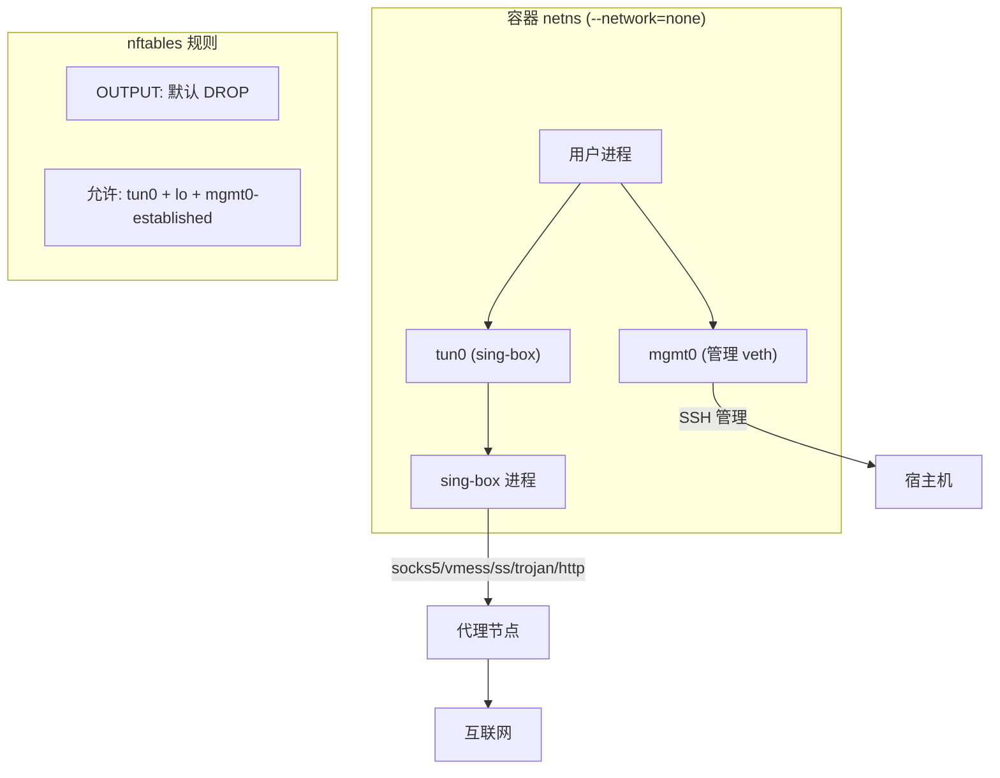
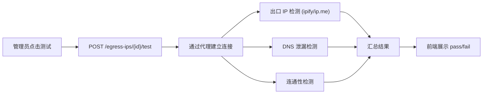

# 支持代理协议（vmess/ss/trojan）出网方案

## 核心思路

当前 WireGuard 方案是在容器的网络命名空间内注入 WireGuard 内核接口，所有流量走 WG 隧道。代理协议方案用 **sing-box 的 tun 模式**替代 WireGuard — sing-box 在容器内创建虚拟网卡（tun），通过代理协议转发所有流量，同样实现内核级全流量强制，不存在泄漏窗口。



## 设计原则

- **SOCKS5 是一等公民** — 默认协议类型，UI 表单最简化（只需 server/port/username/password 四个字段），其他协议作为"高级选项"
- **一键可验证** — 后台提供代理测试功能，覆盖出口 IP 匹配、DNS 泄漏检测和连通性验证，运维方不需要手动 SSH 进容器排查
- **全流量强制不妥协** — sing-box tun 模式 + nftables 默认拒绝，DNS 查询也走代理，与 WireGuard 方案同等安全级别

## 架构变更

### 1. 出口 IP 类型化

在 `egress_ips` 表引入 `tunnel_type` 字段，区分 `wireguard` 和 `proxy`：

- `wireguard`: 现有 `wg_*` 字段生效
- `proxy`: 新增 `proxy_config` JSONB 字段，存储 sing-box outbound 配置

```sql
-- 0004_proxy_tunnel.sql
ALTER TABLE egress_ips ADD COLUMN tunnel_type TEXT NOT NULL DEFAULT 'wireguard';
ALTER TABLE egress_ips ADD COLUMN proxy_config JSONB;
```

`proxy_config` 存储 sing-box outbound 格式的 JSON，不同协议示例如下：

**SOCKS5（含用户名密码）：**
```json
{
  "type": "socks",
  "server": "socks.example.com",
  "server_port": 1080,
  "username": "user",
  "password": "pass",
  "version": "5"
}
```

**VMess：**
```json
{
  "type": "vmess",
  "server": "proxy.example.com",
  "server_port": 443,
  "uuid": "xxxx-xxxx",
  "security": "auto",
  "alter_id": 0,
  "tls": { "enabled": true, "server_name": "proxy.example.com" }
}
```

**Shadowsocks：**
```json
{
  "type": "shadowsocks",
  "server": "ss.example.com",
  "server_port": 8388,
  "method": "2022-blake3-aes-128-gcm",
  "password": "secret"
}
```

**Trojan：**
```json
{
  "type": "trojan",
  "server": "trojan.example.com",
  "server_port": 443,
  "password": "trojan-pass",
  "tls": { "enabled": true, "server_name": "trojan.example.com" }
}
```

**HTTP 代理：**
```json
{
  "type": "http",
  "server": "http-proxy.example.com",
  "server_port": 8080,
  "username": "user",
  "password": "pass"
}
```

这样做的好处是 sing-box 支持的所有协议（socks/vmess/ss/trojan/http/hysteria2/vless 等）都自动支持，不用为每种协议单独建列。用户只需要填 server + port + 认证信息，平台负责把它包装成 tun 全流量代理。

### 2. 数据模型变更

**`internal/store/repository/models.go`** — `EgressIP` 新增:
- `TunnelType string` (wireguard / proxy)
- `ProxyConfig json.RawMessage` (sing-box outbound JSON)

**`internal/network/types.go`** — 新增 `ProxySpec`:

```go
type ProxySpec struct {
    OutboundConfig json.RawMessage // sing-box outbound 配置
    DNSServer      string
    ListenPort     int // sing-box 内部监听端口
}

type EgressConfig struct {
    ExpectedIP  string
    TunnelType  string      // "wireguard" | "proxy"
    Tunnel      *TunnelSpec  // WireGuard 时使用
    Proxy       *ProxySpec   // 代理协议时使用
}
```

### 3. 新增 SingBoxProvider

**`internal/network/singbox_provider_linux.go`** — PrepareHost 流水线:

1. `Egress` 非空校验（同 WireGuard）
2. 获取容器 netns（复用 `GetContainerNetNS`）
3. 注入管理 veth（复用 `InjectManagementVeth`）
4. 生成 sing-box 配置文件（tun inbound + 代理 outbound + dns）
5. 将配置写入容器文件系统（`/proc/<pid>/root/etc/sing-box/config.json`）
6. 在容器 netns 内启动 sing-box 进程（`nsenter` + `sing-box run`）
7. 应用 nftables 规则（允许 tun0 替代 wg 接口）
8. 配置 DNS（sing-box dns 模块处理）
9. 运行三重校验（复用 `VerifyNetworkIntegrity`）

sing-box tun 模式的配置核心:

```json
{
  "inbounds": [{ "type": "tun", "auto_route": true, "strict_route": true }],
  "outbounds": [{ ... proxy_config ... }],
  "dns": { "servers": [{ "address": "dns_server" }] }
}
```

### 4. Provider 工厂

**`internal/network/provider_factory_linux.go`**:

```go
func NewProvider(tunnelType string, logger *slog.Logger) Provider {
    switch tunnelType {
    case "proxy":
        return NewSingBoxProvider(logger)
    default:
        return NewTunnelProvider(logger)
    }
}
```

Worker 中 `provider.PrepareHost` 调用前，根据 `egressConfig.TunnelType` 选择 provider。

### 5. 受管镜像预装 sing-box

**`deploy/docker/managed-user/Dockerfile`** 中添加 sing-box 二进制，与 OpenSSH/claude code 并列。

### 6. 绑定校验适配

**`internal/network/validate.go`** — `ValidateEgressBinding` 根据 `tunnel_type`:
- `wireguard`: 现有逻辑（要求 wg_endpoint + wg_public_key）
- `proxy`: 要求 `proxy_config` 非空且 JSON 合法

### 7. 前端适配

**`web/admin/src/components/egress-ips/egress-ip-drawer.tsx`**:
- 新增 `tunnel_type` 选择器（WireGuard / 代理协议）
- `tunnel_type = wireguard` 时显示现有 WG 字段
- `tunnel_type = proxy` 时显示:
  - 代理协议类型下拉（socks / vmess / shadowsocks / trojan / http）
  - 根据协议类型动态显示对应字段:

| 协议 | 通用字段 | 专用字段 |
|------|---------|---------|
| socks | server, port | username, password |
| vmess | server, port | uuid, security, alter_id, tls |
| shadowsocks | server, port | method, password |
| trojan | server, port | password, tls |
| http | server, port | username, password, tls |

  - 高级模式: 切换到 JSON 编辑器直接编辑 sing-box outbound 配置
- DNS 服务器字段两种类型共用

SOCKS5 场景下用户只需填 4 个字段: 服务器地址、端口、用户名、密码。平台自动处理 tun 全流量接管和 DNS 防泄漏。

### 8. Admin API 适配

**`internal/controlplane/http/admin_egress_ips.go`**:
- `createEgressIPRequest` / `updateEgressIPRequest` 新增 `tunnel_type` 和 `proxy_config`
- 校验逻辑: `proxy` 类型时 `proxy_config` 必填

### 9. 后台一键代理测试

在管理后台为每个出口 IP 资源提供"测试"功能，点一下即跑完所有验证项。

**后端：新增测试 API**

`POST /v1/admin/egress-ips/{ipID}/test`

控制面通过代理配置建立临时 SOCKS5/代理连接，依次执行：

| 测试项 | 方法 | 判定标准 |
|--------|------|---------|
| 连通性 | 通过代理请求 http://connectivitycheck.gstatic.com/generate_204 | 返回 204 |
| 出口 IP | 通过代理请求 https://api.ipify.org, https://ip.me, https://ifconfig.me | 返回 IP 与 `ip_address` 字段一致 |
| DNS 泄漏 | 通过代理解析随机子域名 {random}.dns-leak-test.example，同时直连解析相同域名 | 代理解析成功且与直连解析结果不同（说明 DNS 走了代理） |
| DNS 服务器 | 通过代理请求 https://dnsleaktest.com/api 或 https://ipleak.net/json/ | 返回的 DNS 服务器不是宿主机本地 DNS |

测试结果结构：

```json
{
  "status": "passed",
  "tested_at": "2026-03-28T12:00:00Z",
  "results": {
    "connectivity": { "status": "pass", "latency_ms": 120 },
    "egress_ip": {
      "status": "pass",
      "expected": "1.2.3.4",
      "actual": "1.2.3.4",
      "sources": {
        "ipify": "1.2.3.4",
        "ip_me": "1.2.3.4",
        "ifconfig_me": "1.2.3.4"
      }
    },
    "dns_leak": {
      "status": "pass",
      "dns_servers_detected": ["8.8.8.8"],
      "local_dns_leaked": false
    }
  }
}
```

**实现方式：** 控制面用 Go 的 `golang.org/x/net/proxy` 或直接构造 `net.Dialer` 通过 SOCKS5 代理发起请求，不需要容器运行。对于非 SOCKS5 协议（vmess/ss/trojan），可以临时启动一个 sing-box 进程作为本地 SOCKS5 转发再测试。

**前端：出口 IP 详情页/列表页增加测试按钮**

- 列表页每行加"测试"按钮
- 点击后显示 loading → 结果卡片（pass/fail + 各项详情）
- 测试历史记录最近一次结果，在列表页用绿/红圆点显示
- 出口 IP 创建完成后自动弹出"是否立即测试"



## 不变的部分

- `Provider` 接口签名不变
- `--network=none` 容器隔离不变
- 管理 veth 注入不变
- nftables 默认拒绝策略不变（只是允许的接口从 wg 改为 tun0）
- 三重校验逻辑不变（出口 IP 匹配 + DNS 路径 + 泄漏阻断）
- Bootstrap 流程不变
- host-agent / worker 调度流程不变

## 执行建议

这个改造量相当于一个新的里程碑（v1.1）。建议用 `$gsd-new-milestone` 启动，拆分为:
- Phase 7: 数据层 + 类型化 + 校验适配
- Phase 8: SingBoxProvider 实现 + 受管镜像集成
- Phase 9: 前端适配 + E2E 验证
